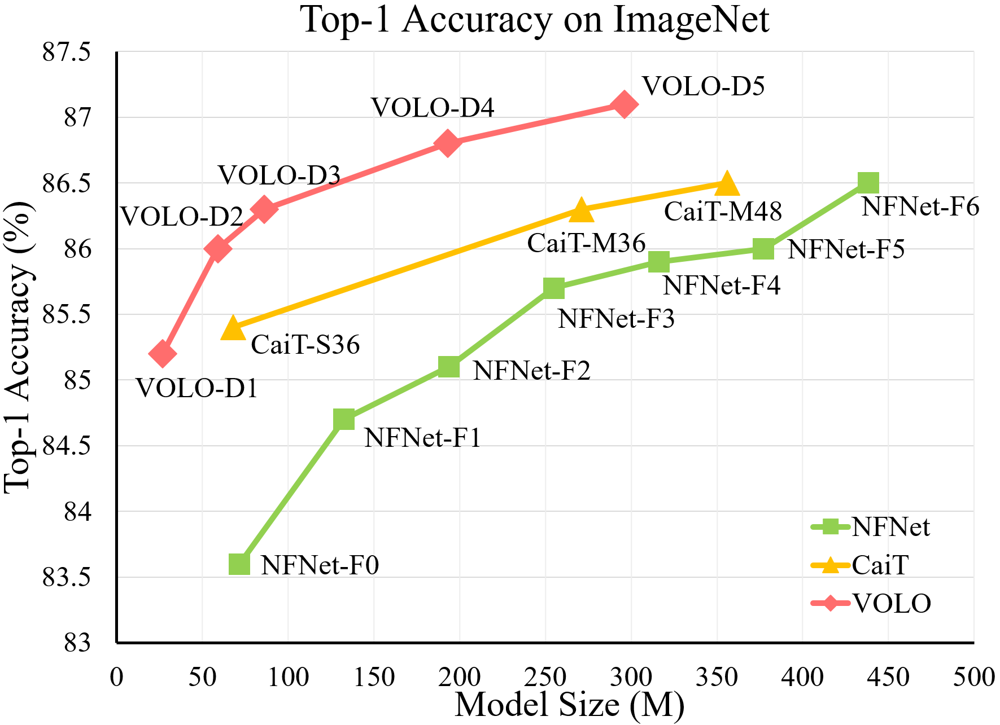
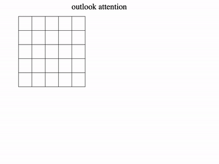

# VOLO: Vision Outlooker for Visual Recognition, [arxiv](https://arxiv.org/abs/2106.13112)

This is a PyTorch implementation of our paper. We present Vision Outlooker (VOLO). We show that our VOLO achieves SOTA performance on ImageNet and CityScapes. No extra training data is used in our work.

ImageNet top-1 accuracy comparison with the state-of-the-art (sota) CNN-based and Transformer-based models. All results are based on the best test resolutions. Our VOLO-D5 achieves SOTA performance on ImageNet without extra data in 2021/06. 


<p align="center">
  
  
</p>

(Updating... codes and models for downstream tasks like semantic segmentation are coming soon.)

#### You may be also interested in our new MLP-like Model: [Vision Permutator](https://github.com/Andrew-Qibin/VisionPermutator) and our [Token Labeling](https://github.com/zihangJiang/TokenLabeling) training objective for Vision Transformers.

## Reference
```
@misc{yuan2021volo,
      title={VOLO: Vision Outlooker for Visual Recognition}, 
      author={Li Yuan and Qibin Hou and Zihang Jiang and Jiashi Feng and Shuicheng Yan},
      year={2021},
      eprint={2106.13112},
      archivePrefix={arXiv},
      primaryClass={cs.CV}
}
```

## 1. Requirements

torch>=1.7.0; torchvision>=0.8.0; [timm](https://github.com/rwightman/pytorch-image-models)==0.4.5; [tlt](https://github.com/zihangJiang/TokenLabeling)==0.1.0; pyyaml; apex-amp


data prepare: ImageNet with the following folder structure, you can extract imagenet by this [script](https://gist.github.com/BIGBALLON/8a71d225eff18d88e469e6ea9b39cef4).

```
│imagenet/
├──train/
│  ├── n01440764
│  │   ├── n01440764_10026.JPEG
│  │   ├── n01440764_10027.JPEG
│  │   ├── ......
│  ├── ......
├──val/
│  ├── n01440764
│  │   ├── ILSVRC2012_val_00000293.JPEG
│  │   ├── ILSVRC2012_val_00002138.JPEG
│  │   ├── ......
│  ├── ......
```

Directory structure in this repo:
```
│volo/
├──figures/
├──loss/
│  ├── __init__.py
│  ├── cross_entropy.py
├──models/
│  ├── __init__.py
│  ├── volo.py
├──utils/
│  ├── __init__.py
│  ├── utils.py
├──LICENSE
├──README.md
├──distributed_train.sh
├──main.py
├──validate.py
```


## 2. VOLO Models

| Model    |  #params | Image resolution | Top1 Acc| Download | 
| :---     |   :---:    |  :---: |  :---:  |  :---:  |
| volo_d1  |    27M     |   224 |  84.2  | [here](https://github.com/sail-sg/volo/releases/download/volo_1/d1_224_84.2.pth.tar) |
| volo_d1 ↑384 |   27M     |   384 |  85.2  | [here](https://github.com/sail-sg/volo/releases/download/volo_1/d1_384_85.2.pth.tar) |
| volo_d2  |   59M     |   224 |  85.2  | [here](https://github.com/sail-sg/volo/releases/download/volo_1/d2_224_85.2.pth.tar) |
| volo_d2 ↑384|   59M     |   384 |  86.0  | [here](https://github.com/sail-sg/volo/releases/download/volo_1/d2_384_86.0.pth.tar) |
| volo_d3  |   86M     |   224 |  85.4  | [here](https://github.com/sail-sg/volo/releases/download/volo_1/d3_224_85.4.pth.tar) | 
| volo_d3 ↑448|   86M     |   448 |  86.3  | [here](https://github.com/sail-sg/volo/releases/download/volo_1/d3_448_86.3.pth.tar) |
| volo_d4  |  193M     |   224 |  85.7  | [here](https://github.com/sail-sg/volo/releases/download/volo_1/d4_224_85.7.pth.tar) |
| volo_d4 ↑448|  193M     |   448 |  86.8  | [here](https://github.com/sail-sg/volo/releases/download/volo_1/d4_448_86.79.pth.tar) |
| volo_d5  |  296M     |   224 |  86.1  | [here](https://github.com/sail-sg/volo/releases/download/volo_1/d5_224_86.10.pth.tar) |
| volo_d5 ↑448|  296M     |   448 |  87.0  | [here](https://github.com/sail-sg/volo/releases/download/volo_1/d5_448_87.0.pth.tar) |
| volo_d5 ↑512|  296M     |   512 |  87.1  | [here](https://github.com/sail-sg/volo/releases/download/volo_1/d5_512_87.07.pth.tar) |

All the pretrained models can also be downloaded by [BaiDu Yun](https://pan.baidu.com/s/1l7NfploIiZX9WbTPdwT3rQ) (password: ttbp).

### Usage
Instructions on how to use our pre-trained VOLO models:
```python3
from models.volo import *
from utils import load_pretrained_weights 

# create model
model = volo_d1()

# load the pretrained weights
# change num_classes based on dataset, can work for different image size 
# as we interpolate the position embeding for different image size.
load_pretrained_weights(model, "/path/to/pretrained/weights", use_ema=False, 
                        strict=False, num_classes=1000)  
```
We also provide a [Colab notebook](https://colab.research.google.com/github/sail-sg/volo/blob/main/utils/volo_demo.ipynb) which run the steps to perform inference with VOLO.


## 3. Validation

To evaluate our VOLO models, run:

```bash
python3 validate.py /path/to/imagenet  --model volo_d1 \
  --checkpoint /path/to/checkpoint --no-test-pool --apex-amp --img-size 224 -b 128
```
Change the --img-size from 224 to 384 or 448 for different image resolution, for example, to evaluate volo-d5 on 512 (87.1), run:

```bash
python3 validate.py /path/to/imagenet  --model volo_d5 \
  --checkpoint /path/to/volo_d5_512 --no-test-pool --apex-amp --img-size 512 -b 32
```


## 4. Train

As we use token labeling, please download the token labeling data in [Google Drive](https://drive.google.com/file/d/1Cat8HQPSRVJFPnBLlfzVE0Exe65a_4zh/view) or [BaiDu Yun](https://pan.baidu.com/s/1YBqiNN9dAzhEXtPl61bZJw) (password: y6j2), details about token labling are in [here](https://github.com/zihangJiang/TokenLabeling).

For each VOLO model, we first train it with image-size as 224 then finetune on image-size as 384 or 448/512:
<details>
<summary>
  train volo_d1 on 224 and finetune on 384
</summary>
8 GPU, batch_size=1024, 19G GPU-memory in each GPU with apex-amp (mixed precision training)
 
Train volo_d1 on 224 with 310 epoch, acc=84.2
```bash
CUDA_VISIBLE_DEVICES=0,1,2,3,4,5,6,7 ./distributed_train.sh 8 /path/to/imagenet \
  --model volo_d1 --img-size 224 \
  -b 128 --lr 1.6e-3 --drop-path 0.1 --apex-amp \
  --token-label --token-label-size 14 --token-label-data /path/to/token_label_data
```

Finetune on 384 with 40 epoch based on the pretrained checkpoint on 224, final acc=85.2 on 384
  
```bash
CUDA_VISIBLE_DEVICES=0,1,2,3,4,5,6,7 ./distributed_train.sh 8 /path/to/imagenet \
  --model volo_d1 --img-size 384 \
  -b 64 --lr 8.0e-6 --min-lr 4.0e-6 --drop-path 0.1 --epochs 30 --apex-amp \
  --weight-decay 1.0e-8 --warmup-epochs 5  --ground-truth \
  --token-label --token-label-size 24 --token-label-data /path/to/token_label_data \
  --finetune /path/to/pretrained_224_volo_d1/
```
  
</details>

<details>
<summary>
  train volo_d2 on 224 and finetune on 384
</summary>
8 GPU, batch_size=1024, 27G GPU-memory in each GPU with apex-amp (mixed precision training)
 
Train volo_d2 on 224 with 300 epoch, acc=85.2
```
CUDA_VISIBLE_DEVICES=0,1,2,3,4,5,6,7 ./distributed_train.sh 8 /path/to/imagenet \
  --model volo_d2 --img-size 224 \
  -b 128 --lr 1.0e-3 --drop-path 0.2 --apex-amp \
  --token-label --token-label-size 14 --token-label-data /path/to/token_label_data
```

Finetune on 384 with 30 epoch based on the pretrained checkpoint on 224, final acc=86.0 on 384
  
```
CUDA_VISIBLE_DEVICES=0,1,2,3,4,5,6,7 ./distributed_train.sh 8 /path/to/imagenet \
  --model volo_d2 --img-size 384 \
  -b 48 --lr 8.0e-6 --min-lr 4.0e-6 --drop-path 0.2 --epochs 30 --apex-amp \
  --weight-decay 1.0e-8 --warmup-epochs 5  --ground-truth \
  --token-label --token-label-size 24 --token-label-data /path/to/token_label_data \
  --finetune /path/to/pretrained_224_volo_d2/
```
  
</details>

<details>
<summary>
  train volo_d3 on 224 and finetune on 448
</summary>
 
Train volo_d3 on 224 with 300 epoch, acc=85.4
```
CUDA_VISIBLE_DEVICES=0,1,2,3,4,5,6,7 ./distributed_train.sh 8 /path/to/imagenet \
  --model volo_d3 --img-size 224 \
  -b 128 --lr 1.0e-3 --drop-path 0.5 --apex-amp \
  --token-label --token-label-size 14 --token-label-data /path/to/token_label_data
```

Finetune on 448 with 30 epoch based on the pretrained checkpoint on 224, final acc=86.3 on 448
  
```
CUDA_VISIBLE_DEVICES=0,1,2,3,4,5,6,7 ./distributed_train.sh 8 /path/to/imagenet \
  --model volo_d3 --img-size 448 \
  -b 30 --lr 8.0e-6 --min-lr 4.0e-6 --drop-path 0.5 --epochs 30 --apex-amp \
  --weight-decay 1.0e-8 --warmup-epochs 5  --ground-truth \
  --token-label --token-label-size 24 --token-label-data /path/to/token_label_data \
  --finetune /path/to/pretrained_224_volo_d3/
```
  
</details>

## 5. Acknowledgement
We gratefully acknowledge the support of NVIDIA AI Tech Center (NVAITC) to this research project, especially the great helps in GPU technology supports from Terry Jianxiong Yin (NVAITC) and Qingyi Tao (NVAITC).

Related project: [T2T-ViT](https://github.com/yitu-opensource/T2T-ViT), [Token_labeling](https://github.com/zihangJiang/TokenLabeling), [pytorch-image-models](https://github.com/rwightman/pytorch-image-models), [official imagenet example](https://github.com/pytorch/examples/tree/master/imagenet)

## LICENSE

This repo is under the Apache-2.0 license. For commercial use, please contact with the authors.
